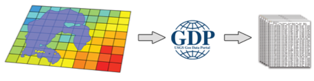
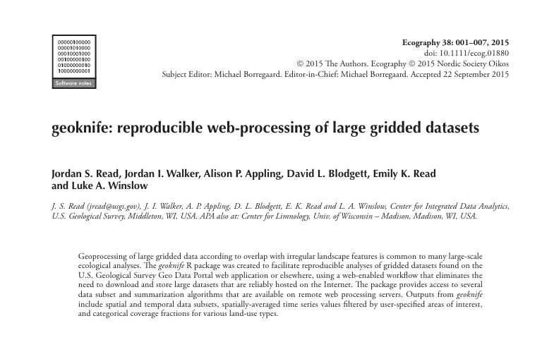

```{r setup, include=FALSE}
knitr::opts_chunk$set(echo = FALSE)
```

## Introduction

What is `geoknife`?
<p align="center">
  
</p>

* R-package to get climate data into R

The `geoknife` package was created to support web-based geoprocessing of large gridded datasets according to their overlap with landscape (or aquatic/ocean) features that are often irregularly shaped. geoknife creates data access and subsequent geoprocessing requests for the USGS's Geo Data Portal to carry out on a web server. 

`geoknife`: 
 
* allows the user to avoid downloading large datasets
* avoids reinventing the wheel for the creation and optimization of complex geoprocessing algorithms
* uses computing resources that are dedicated elsewhere, so geoknife operations do not have much of an impact on a local computer

## Introduction

read more about `geoknife`:  
<p align="center">
  <a href="http://onlinelibrary.wiley.com/doi/10.1111/ecog.01880/full"></a>
</p>
## Introduction

Where does the data come from?

* US Geological Survey
    + Climate and Land Use mission
* NASA
    + NLDAS, GLDAS, various
    + more being added....
* NOAA
    + NARR, many others
* Academia
    + E.g., PRISM

## Introduction
What does `geoknife` do to the data?

* `geoknife` subsets and/or summarizes data on a webserver, and let's you know when it is complete


## Introduction
What does `geoknife` do to the data?

* `geoknife` subsets and/or summarizes data on a webserver, and let's you know when it is complete


## Introduction
How to discover datasets?

* Using the `geoknife` `query()` function (examples to follow)
* Searching the [GDP catalog](http://cida.usgs.gov/gdp/)
* Websearches for OPeNDAP datasets (e.g., [apdrc website](http://apdrc.soest.hawaii.edu/data/data.php))


## Overview
geoknife concepts:
```{r, echo=T, eval=F}
geoknife(stencil, fabric, knife)
```
* `stencil`: the "feature" (lake, watershed, point, state, etc)
* `fabric`: the web available gridded data to be processed
* `knife`: processing configuration

## Stencil
A stencil can be defined in a number of different ways:  

* a numeric vector of lon, lat (`simplegeom` class)
```{r, echo=T, eval=F}
stencil = c(-89, 46)
```
* an R `data.frame()` (`simplegeom` class)
```{r, echo=T, eval=F}
stencil = data.frame('point1'=c(-89, 46), 'point2'=c(-88.6, 45.2))
```
* web available data (`webgeom` class)
```{r, echo=T, eval=F}
stencil = webgeom('state::New Hampshire,Wisconsin')
stencil = webgeom('ecoregion::Colorado Plateaus,Driftless Area')
```

## NWIS Overview (US Geological Survey water data)

* Unit Data
    + "Real-time" data
    + Available data from 2007 (big improvement from 120 days!)
  
* Daily Data
    + Data aggregated from the unit data to a daily statistic
    + This data can go back many decades
    
* Discrete Data
    + Water quality data
    + Groundwater level
    + Rating curves
    + Surfacewater measurements
    
* Meta Data
    + Site information
    + Parameter information

## NWIS Links
More information:

[Water Services](http://waterservices.usgs.gov/)

[Help](http://help.waterdata.usgs.gov/)

## Water Quality Portal
[Water Quality Portal](http://www.waterqualitydata.us/)

## Slide with R Output

```{r cars, echo = TRUE}
summary(cars)
```

## Slide with Plot

```{r pressure}
plot(pressure)
```
