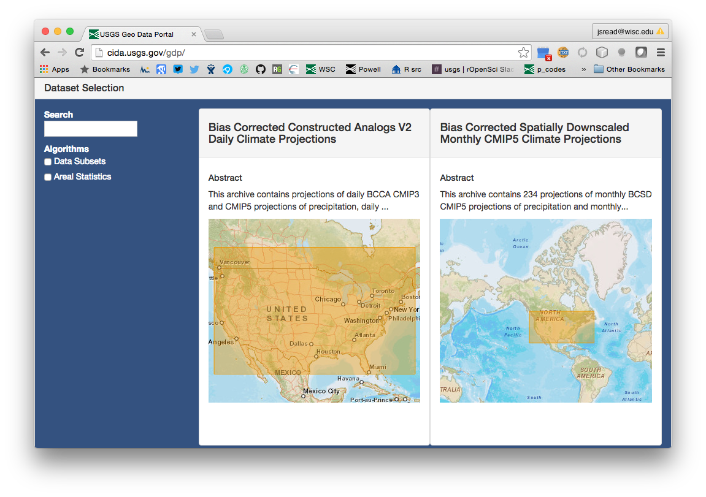

```{r setup, include=FALSE}
options(width=60)
knitr::opts_chunk$set(echo = FALSE, tidy = TRUE)
library(geoknife)
gconfig(wps.url='http://cida-test.er.usgs.gov/gdp/process/WebProcessingService')
```

## Introduction

What is `geoknife`?
<p align="center">
  
</p>

* R-package to get climate data into R

The `geoknife` package was created to support web-based geoprocessing of large gridded datasets according to their overlap with landscape (or aquatic/ocean) features that are often irregularly shaped. geoknife creates data access and subsequent geoprocessing requests for the USGS's Geo Data Portal to carry out on a web server. 

`geoknife`: 
 
* allows the user to avoid downloading large datasets
* avoids reinventing the wheel for the creation and optimization of complex geoprocessing algorithms
* uses computing resources that are dedicated elsewhere, so geoknife operations do not have much of an impact on a local computer

## Introduction

read more about `geoknife`:  
<p align="center">
  <a href="http://onlinelibrary.wiley.com/doi/10.1111/ecog.01880/full"></a>
</p>
## Introduction

Where does the data come from?

* US Geological Survey
    + Climate and Land Use mission
* NASA
    + NLDAS, GLDAS, various
    + more being added....
* NOAA
    + NARR, many others
* Academia
    + E.g., PRISM

## Introduction
What does `geoknife` do to the data?

* `geoknife` subsets and/or summarizes data on a webserver, and let's you know when it is complete


## Introduction
How to discover datasets?

* Using the `geoknife` `query()` function (examples to follow)
* Searching the [GDP catalog](http://cida.usgs.gov/gdp/)
* Websearches for OPeNDAP datasets (e.g., [apdrc website](http://apdrc.soest.hawaii.edu/data/data.php))


## Overview
geoknife concepts:
```{r, echo=T, eval=F}
geoknife(stencil, fabric, knife)
```
* `stencil`: the "feature" (lake, watershed, point, state, etc)  

  

* `fabric`: the web available gridded data to be processed  

  

* `knife`: processing configuration  


## Overview
geoknife concepts:
```{r, echo=T, eval=F}
geoknife(stencil, fabric, knife)
```
* `geoknife` uses the `stencil`, `fabric` and `knife` to subset and/or summarize data on a webserver and deliver the result back to you. 


## Stencil
A stencil can be defined in a number of different ways:  

* a numeric vector of lon, lat (`simplegeom` class)
```{r, echo=T, eval=F}
stencil = c(-89, 46)
```
* an R `data.frame()` (`simplegeom` class)
```{r, echo=T, eval=F}
stencil = data.frame('point1'=c(-89, 46), 'point2'=c(-88.6, 45.2))
```
* as a `sp::SpatialPolygons` class from a local shapefile  

This is kind of a a hack right now, so I am not going to show it. But suggest it [here](https://github.com/USGS-R/geoknife/issues) if you want it.

* web available data (`webgeom` class) that are quickstart
```{r, echo=T, eval=F}
stencil = webgeom('state::New Hampshire,Wisconsin')
stencil = webgeom('ecoregion::Colorado Plateaus,Driftless Area')
```
* web available data (`webgeom` class) from a shapefile that you have uploaded
```{r, echo=T, eval=F}
stencil = webgeom(geom="upload:CIDA_TEST_", attribute = "Letter", value= "C")
```

## Stencil
Note the main difference between `simplegeom` and `webgeom` is their location/reference. 

* `simplegeom` is something that exists in your R environment
* `webgeom` is a web resource, using the Web Feature Service standard

In my workflows, I tend to use both: 

`simplegeoms` for point collections (lon, lat)
```{r, echo=T, eval=F}
stencil = data.frame('point1'=c(-89, 46), 'point2'=c(-88.6, 45.2))
```
`webgeoms` for getting data from an existing HUC, state, or uploading a bigger more complex file to be used again and again:
```{r, echo=T, eval=F}
stencil = webgeom('HUC8::09020306,14060009')
```
BTW, `webgeom('HUC8::09020306,14060009')` is equivalent to:
```{r, echo=T, eval=F}
stencil = webgeom(geom = 'derivative:wbdhu8_alb_simp',  
                  attribute = 'HUC_8',  
                  values = c('09020306', '14060009'))
```
`geoknife` has some "quickstart" references that simplify syntax for common stencils and fabric

## Stencil
`print` in R will tell you what you are working with for the different object classes:
```{r, echo=T}
stencil = webgeom('HUC8::09020306,14060009')
stencil
```
and you can modify things:
```{r, echo=T}
values(stencil) <- c("07140103", "07140108", "12100202","12060104", "12060101")
stencil
```

## Fabric
There is only one `geoknife` class that can be used for fabric, the `webdata` class (maybe more will exist in the future).

`webdata` has some important fields:  

* `times`: the time range that you want access to (default is `c(NA, NA)`, which is "all time")
* `url`: the url of the dataset's OPeNDAP endpoint (or Web Covereage Service endpoint)
* `variables`: the variables you want access to. 
print method works for these too:  
```{r, echo=T}
webdata()
```

## Fabric
You can define values for those fields when creating `webdata`:
```{r, echo=T}
fabric = webdata(url = 'http://cida.usgs.gov/thredds/dodsC/prism_v2',  
        times = c('1990-01-01','2010-01-01'),
        variables = c('ppt','tmx'))
fabric
```
and access and set them:
```{r, echo=T}
times(fabric)[1] <- '1899-01-01'
variables(fabric) <- 'tmn'
fabric
```

## Knife
There is only one `geoknife` class that can be used for knife, the `webprocess` class (maybe more will exist in the future).

`webprocess` has some important fields:  

* `url`: the url of the web processing service to be used
* `algorithm`: a list specifying the algorithm to be used for processing. Defaults to Area Grid Statistics (weighted).
* `version`: the webprocessing version to use (there is only one right now, `1.0.0`)
* `processInputs`: a list of processing details for the specified `algorithm`. These details vary depending on `algorithm` and are this field is automatically reset when the `algorithm` field is set.
* `wait`: do you want R to wait while the process runs? Defaults to `FALSE`
* `email`: an email address to use if you want to be notified when the process is complete

## Knife
print method works for these too:  

```{r, echo=T}
webprocess()
```

## Knife
modify when you create:  

```{r, echo=T}
webprocess(DELIMITER='TAB', REQUIRE_FULL_COVERAGE=FALSE, wait=TRUE)
```

## geoknife
Now we can put it all together

An example of processing PRISM data for two points:

```{r, echo=T}
job <- geoknife(stencil = c(-89,42), fabric = 'prism', wait = TRUE)
```

Note, the structure of the `geoknife` function is `geoknife(stencil, fabric, knife = webprocess(...), ...)`, meaning that only the `stencil` and `fabric` arguments are required, and the `knife` (if ommitted) will use defaults.  

The `...` mean that any additional named arguments passed into the `geoknife()` will go into the `webprocess()`. This feature can be handy for specifying `wait=TRUE` and others

## geoknife
When a job is complete, you can `download` it to a local file, or load the `result` into R

```{r, echo=T}
download(job, destination='prism_results.csv')
data <- result(job, with.units = TRUE)
head(data)
```
```{r}
unlink('prism_results.csv')
```
## geoknife
The text results of the process are formatted according to the naming of the features you use for `stencil`

In the example above, a simple lon/lat point was used, so it gets a default name ("bufferedPoint")

Using more features will yield more columns in the result:
```{r, echo=T}
fabric <- webdata('prism',variables='tmx', times=c('1895-01-01','1895-05-01'))
job <- geoknife(stencil = 'state::Wisconsin,Virginia', fabric, wait = TRUE)
result(job, with.units = TRUE)
```

## gconfig
I like to toggle some default settings for knife. Those are available in the `gconfig()` function, which behaves like `graphics::par()`
```{r, echo=T}
gconfig()
gconfig('wait')
```

## gconfig
A number of the defaults in `geoknife` operations can be modified here, so if you always want to wait for jobs to finish, and want a different sleep time (the time `geoknife` waits in between checking to see if the job is finished), do it here:
```{r, echo=T}
gconfig('wait' = TRUE, 'sleep.time' = 30)
```

but you can always override them with arguments to `geoknife()`

```{r, echo=T, eval=F}
# will wait because gconfig('wait') is TRUE
job <- geoknife('state::Wisconsin,Virginia', fabric) 

# will not wait for the job to complete
job <- geoknife('state::Wisconsin,Virginia', fabric, wait = FALSE) # will not wait 
```

## finding things
OK, so these tools seem powerful, right? But how do you actually find things to process or figure out what the values of your `webgeom` can be?

The `query()` function is the catch-all for finding things. `query` methods exist for `webgeom`, `webdata`, `webprocess`, etc. 

The format is `query(.object, field)`, such as:
```{r, echo=T}
query(webgeom(), 'geoms')
```

## finding things
likewise
```{r, echo=T}
query(webprocess(), 'algorithms')
```
and
```{r, echo=T}
query(webdata('prism'), 'variables')
```

## finding things
One of the more powerful uses of `query` is to find datasets that are already indexed by the Geo Data Portal:
```{r, echo=T}
webdatasets <- query('webdata')
length(webdatasets)
webdatasets[61:65]
```

## finding things
Methods for the dataset groups (of class `datagroup`) include `title` and `abstract`
```{r, echo=T}
title(webdatasets[87])
abstract(webdatasets[87])
```

## finding things
Choose a dataset you found for processing
```{r, echo=T, eval=F}
fabric <- webdata(webdatasets[87])
variables(fabric) <- query(fabric, 'variables')[1]
job <- geoknife(c(-89, 43.1), fabric)
```

## finding things 
There are hundreds (or potentially thousands) of additional OPeNDAP datasets that will work with geoknife, but need to be found through web searches or catalogs (e.g., [www.esrl.noaa.gov/psd/thredds/dodsC/Datasets](www.esrl.noaa.gov/psd/thredds/dodsC/Datasets) and [apdrc.soest.hawaii.edu/data/data.php](http://apdrc.soest.hawaii.edu/data/data.php) ). 

One such example is Sea Surface Temperature from the Advanced Very High Resolution Radiometer (AVHRR) temperature sensing system. Specifying datasets such as this requires finding out the OPeNDAP endpoint (URL) for the dataset, and specifying it as the `url` to webdata (we found this example in the extensive apdrc.soest.hawaii.edu/data/data.php catalog):
```{r, echo=T}
fabric <- webdata(url='dods://apdrc.soest.hawaii.edu/dods/public_data/satellite_product/AVHRR/avhrr_mon')
```
`query` for `variables` doesn't work for this dataset, because it actually doesn't have units and therefore "valid" variables are not returned (instead you get an empty list). From the OPeNDAP endpoint, it is clear that this dataset has one variable of interest, which is called 'sst':
```{r, echo=T}
variables(fabric) <- 'sst'
query(fabric, 'times')
```

```{r}
times(fabric) <- c('1990-01-01','1999-12-31')
```

## finding things 
plotting the July surface temperature of a spot on the Caspian Sea is done by:
```{r, echo=T, eval=FALSE}
sst = result(geoknife(data.frame('caspian.sea'=c(51,40)), fabric, wait = TRUE))
head(sst)
july.idx <- months(sst$DateTime) == 'July'
plot(sst$DateTime[july.idx], sst$caspian.sea[july.idx], type='l', 
     lwd=2, col='dodgerblue', ylab='Sea Surface Temperature (degC)',xlab=NA)
```
```{r, echo=FALSE, fig.height=3, fig.width=8}
load(system.file('extdata', 'sst_result.RData', package = 'geoknife'))
head(sst, 2)
july.idx <- months(sst$DateTime) == 'July'
par(mar=c(2,4,.5,.5))
plot(sst$DateTime[july.idx], sst$caspian.sea[july.idx], type='l', lwd=2, col='dodgerblue', ylab='Sea Surface Temperature (degC)',xlab=NA)
```


## geoknife in action
For our lake modeling activities, we use `geoknife` to create driver data for each lake we are modeling, and also to extract land-cover data from the NLCD that is in the buffer of each lake (for wind sheltering).

Alternatively, there are some examples in our [geoknife paper](http://onlinelibrary.wiley.com/doi/10.1111/ecog.01880/full) and our [geoknife blog post](http://www.ecography.org/blog/slicing-gridded-data-geoknife)

Looking at PRISM data for ecoregion:


## geoknife in action

For our lake modeling activities, we use `geoknife` to create driver data for each lake we are modeling, and also to extract land-cover data from the NLCD that is in the buffer of each lake (for wind sheltering).

Alternatively, there are some examples in our [geoknife paper](http://onlinelibrary.wiley.com/doi/10.1111/ecog.01880/full) and our [geoknife blog post](http://www.ecography.org/blog/slicing-gridded-data-geoknife)

And plotting time series data:


## geoknife for the script averse
<p align="center">
  <a href="http://cida.usgs.gov/gdp/"></a>
</p>
