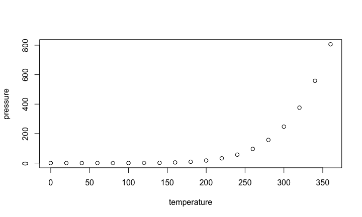

# dataRetrival Tutorial
<b>USGS</b>: Jordan S Read  
`r format(Sys.time(), '%d %B, %Y')`  


## Introduction

What is `geoknife`?

* R-package to get climate data into R

Where does the data come from?

* US Geological Survey
    + Climate and Land Use mission
* NASA
    + NLDAS, GLDAS, various
    + more being added....
* Academia
    + E.g., PRISM

What does `geoknife` do to the data?

* 

How to discover data?

* Examples will be provided


## Overview


## NWIS Overview (US Geological Survey water data)

* Unit Data
    + "Real-time" data
    + Available data from 2007 (big improvement from 120 days!)
  
* Daily Data
    + Data aggregated from the unit data to a daily statistic
    + This data can go back many decades
    
* Discrete Data
    + Water quality data
    + Groundwater level
    + Rating curves
    + Surfacewater measurements
    
* Meta Data
    + Site information
    + Parameter information

## NWIS Links
More information:

[Water Services](http://waterservices.usgs.gov/)

[Help](http://help.waterdata.usgs.gov/)

## Water Quality Portal
[Water Quality Portal](http://www.waterqualitydata.us/)

## Slide with R Output


```r
summary(cars)
```

```
##      speed           dist       
##  Min.   : 4.0   Min.   :  2.00  
##  1st Qu.:12.0   1st Qu.: 26.00  
##  Median :15.0   Median : 36.00  
##  Mean   :15.4   Mean   : 42.98  
##  3rd Qu.:19.0   3rd Qu.: 56.00  
##  Max.   :25.0   Max.   :120.00
```

## Slide with Plot


