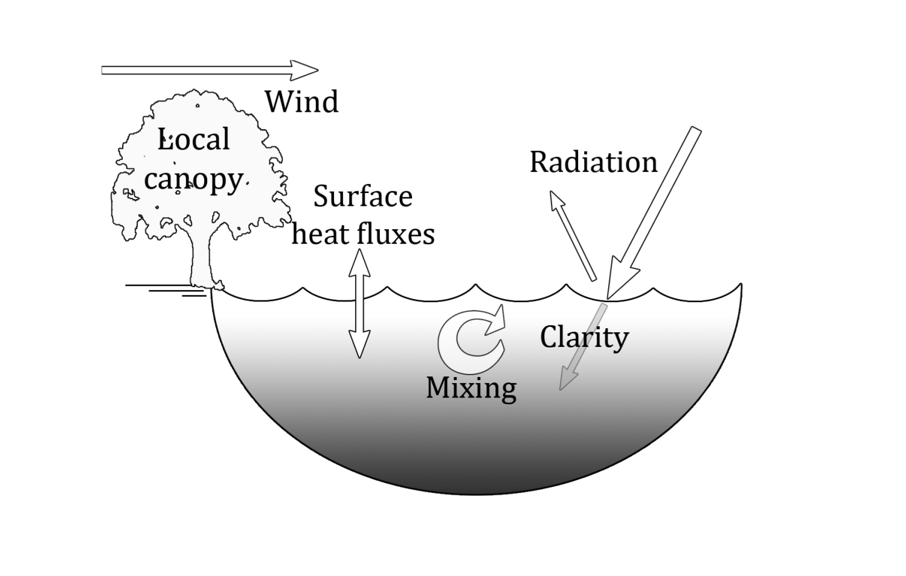
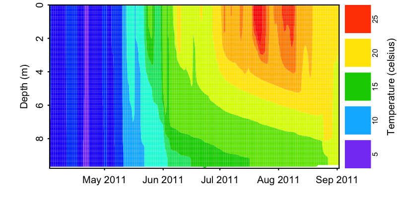
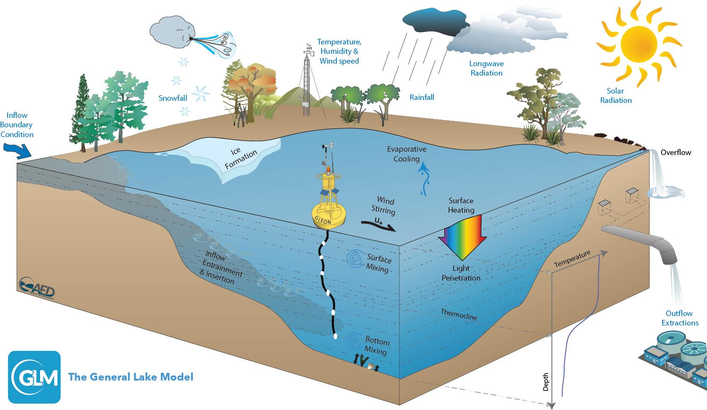
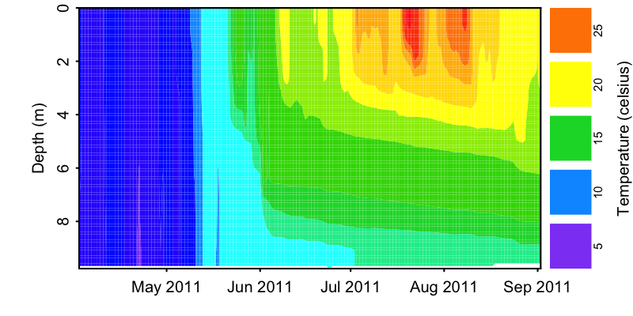
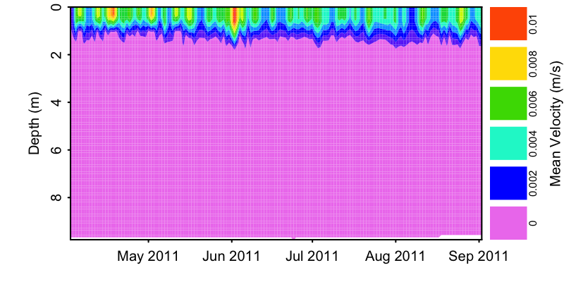
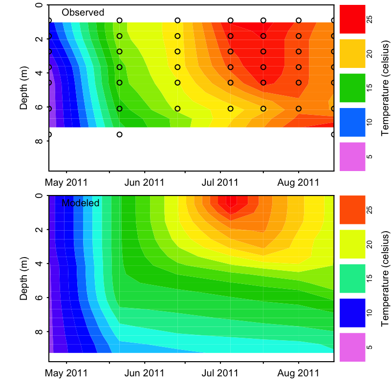

```{r setup, include=FALSE}
options(width=65)
knitr::opts_chunk$set(echo = TRUE, tidy = TRUE)
library(glmtools)
```

## Introduction
Goals for Part II of today's workshop 

* **GLM**: basic understanding of lake model
* **GLMr**: run GLM from R, keep up-to-date version 
* **glmtools**: reproducible model results handling and visualizations
* **What's next?**: linking lake models to catchment hydrology

## Lake modeling overview
<p align="center">
  
</p>

## Lake modeling overview



## GLM
<div class="indent large">GLM "General Lake Model"</div>
<div class="indent large">Authors: Matthew R Hipsey, Louise C Bruce, David P Hamilton</div>
<div class="indent large">Location: [GLM website](http://aed.see.uwa.edu.au/research/models/GLM/)</div>

The GLM model has been developed as an initiative of the Global Lake Ecological Observatory Network (GLEON) and in collaboration with the Aquatic Ecosystem Modelling Network (AEMON) that started in 2010. The model was first introduced in Leipzig at the 2nd Lake Ecosystem Modelling Symposium in 2012, and has since developed rapidly with application to numerous lakes within the GLEON network and beyond.

Source code available at
[http://github.com/GLEON/GLM-source](http://github.com/GLEON/GLM-source)

## GLM overview
<p align="center">
  
</p>

## GLM overview


## GLM overview


## GLM overview


## GLMr

<div class="indent large">GLMr R package</div>
<div class="indent large">Maintainer: Luke A Winslow  </div>
<div class="indent large">Authors: Luke A Winslow, Jordan S Read  </div>
<div class="indent large">Location: [https://github.com/GLEON/GLMr](https://github.com/GLEON/GLMr)</div>

GLMr holds the current version of the "General Lake Model",  
and can run the model on all platforms (windows, mac, linux)
directly from R

## Installation

`glmtools` is available on the GRAN repository. 

```{r echo=TRUE, eval=FALSE}
install.packages(c("GLMr", "glmtools"), 
                 repos=c("http://owi.usgs.gov/R",
                         getOption("repos")))
```

More information can be found [here](http://owi.usgs.gov/R/gran.html).

## GLMr

GLMr Code in R:

```{r echo=TRUE, eval=FALSE}
library(GLMr) 

glm_version()

nml_template_path()
```
Explanation

 - load the GLMr package in R  

 - get the current version of GLM  
    
 - find the included example glm.nml  

## GLMr

GLMr Code in R:  

 - run the GLM model on your computer
```{r, echo=TRUE, eval=FALSE}
run_glm(sim_folder)
```

```
       ------------------------------------------------
       |  General Lake Model (GLM)   Version 2.1.8    |
       ------------------------------------------------
nDays 0 timestep 3600.000000
Maximum lake depth is 9.753600
Wall clock start time :  Mon Mar 07 16:28:55 2016
Simulation begins...
Wall clock finish time : Mon Mar 07 16:28:55 2016
Wall clock runtime 0 seconds : 00:00:00 [hh:mm:ss]

------------------------------------------------
              Run Complete
Reading config from glm2.nml
No WQ config
No diffuser data, setting default values
simulation complete. 

```


 
## GLMr

```{r}
citation('GLMr')
```

Explanation

 - Get the current citation for GLM

## glmtools
<div class="indent large">glmtools R package</div>
<div class="indent large">Maintainer: Jordan S Read   </div>
<div class="indent large">Authors: Jordan S Read, Luke A Winslow  </div>
<div class="indent large">Location: <a target="_blank" title="glmtools on github" href="https://github.com/USGS-R/glmtools">https://github.com/USGS-R/glmtools</a></div>

glmtools includes basic functions for calculating physical derivatives and thermal properties of model output, and plotting functionality. glmtools uses GLMr to run GLM


## glmtools section 1

**Goals**  
 - *understand model inputs*  
 - *run model*  
 - *visualize results*  

## glmtools model inputs: parameters


 - **Excercise:** create and find your example folder

I am going to use a temporary directory, but you can pick
any empty directory you want
```{r}
library(glmtools)
```
```{r, echo=TRUE}
tmp_run_dir = file.path(tempdir(), 'glm_egs')
tmp_run_dir
dir.create(tmp_run_dir)

```
 - Navigate to that directory in your file finder
  
## glmtools run example simulation
Now run the `run_example_sim` command and see the files created
```{r, echo=TRUE}
run_example_sim(tmp_run_dir, verbose=FALSE)
```
You should have a directory that looks like this


## glmtools model inputs: parameters 
 - load glmtools  
 
 - specify location of glm.nml file  
 
 - read glm.nml file into R  
 
 - print (view) the contents of the nml file
```{r}
library(glmtools)
nml_file <- file.path(tmp_run_dir, 'glm2.nml')
nml <- read_nml(nml_file)
nml
```

## glmtools model inputs: parameters
 - get values for specific parameters 
 
```{r}
get_nml_value(nml,'sim_name')
get_nml_value(nml,'Kw')
```

 
## glmtools model inputs: meteorological drivers

 - plot meteorological drivers for simulation  
 
```{r, plot_meteo}
plot_meteo(nml_file)
```


## glmtools run model

 - set simulation folder for GLM  
 
 - run GLM model
```{r}
basename(tmp_run_dir)
run_glm(tmp_run_dir)

```

## glmtools visualize results
 - set output results file  
 
 - plot water temperatures
```{r}
nc_file <- file.path(tmp_run_dir,'output.nc')
```
```{r}
plot_temp(file = nc_file, fig_path = '../images/temperature.png')
```


## glmtools section 2
**Goals**  
 - *validate/evaluate model outputs*  
 - *modify model parameters*  
 - *run simulation with modified parameters*  

## glmtools: modify model parameters

 - change parameter value  
 - view nml with change
```{r}
nml <- set_nml(nml, arg_name = 'Kw', 
          arg_val = 1.05)
```
```{r}
print(nml)
```

 
## glmtools: re-run simulation

 - write changed glm.nml to file  
 
 - run GLM model
```{r}
write_nml(glm_nml = nml, file = nml_file)

run_glm(tmp_run_dir)
```

 
## glmtools: visualize result
 - double check nc_file path
 
 - quickly visualize new temps
```{r}
nc_file <- file.path(tmp_run_dir,'output.nc')
plot_temp(file = nc_file, fig_path = '../images/temperature2.png')
```



## glmtools: visualize result
 
 - find simulation variables

```{r}
sim_vars(file = nc_file)
```

## glmtools: visualize result 

 - quickly visualize other variables
 
```{r}
plot_var(file = nc_file, var_name = 'u_mean', fig_path = '../images/velocity.png')
```


## glmtools: visualize result 

 - quickly compare to field data
```{r, eval=FALSE, results='hide'}
field_file <- file.path(tmp_run_dir, 'field_data.tsv')
plot_var_compare(nc_file, field_file, 'temp', resample=TRUE, fig_path = '../images/temp_compare.png')
```
