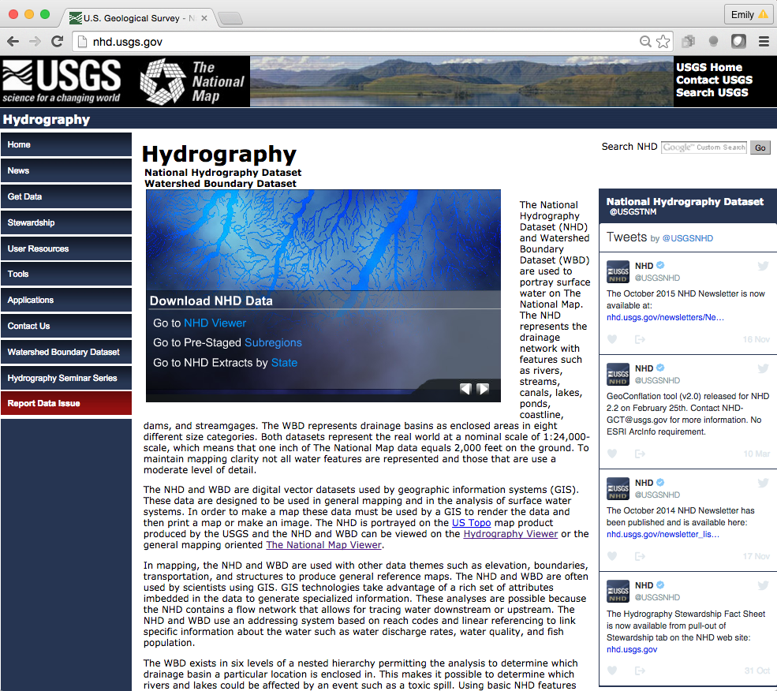

```{r setup, include=FALSE}
knitr::opts_chunk$set(echo = FALSE)
```


## Overview of USGS National Map
##### [The National Map](http://nationalmap.gov/#) includes orthoimagery (aerial photographs), elevation, geographic names, hydrography, boundaries, transportation, structures, and land cover.

1. [Nat'l Map FAQs](http://www.usgs.gov/faq/categories/9854)
2. [Nat'l Map REST services](http://services.nationalmap.gov/arcgis/rest/services)
3. [Nat'l Map Download client](http://viewer.nationalmap.gov/basic/)
<p align="center">
  
</p>


## USGS National Hydrography Dataset (NHD)
### a.k.a. 'the blue lines'

1. Primary purpose: to portray water on The National Map (non-directed network)
2. Drainage network including rivers, streams, canals, lakes, ponds, coastline, dams, and streamgages
3. Available in 1:1,000,000; 1:100,000 ('medium res'); and 1:24,000 ('high res' or 'local res').
3. Used in conjunction with USGS Watershed Boundary Dataset, and 3D Elevation Program (3DEP) to create the NHD+
<p align="center">
  
</p>

[NHD and WBD FAQs](http://nhd.usgs.gov/Frequently+Asked+Questions+about+the+NHD+&+WBD.pdf)

##NHD


## Access NHD
<p align="center">
  
</p>
1. [Download from nhd.usgs.gov](http://nhd.usgs.gov/index.html)
2. [K. Bocinsky's FedData R package](https://cran.r-project.org/web/packages/FedData/index.html)
3. [Nat'l Map REST services](http://services.nationalmap.gov/arcgis/rest/services)
4. [Nat'l Map Download client](http://viewer.nationalmap.gov/basic/)

  

*"Can I deal with NHD in the cloud?"*

##NHD+
NHDPlus is an integrated suite of application-ready geospatial data sets that incorporate many of the best features of the National Hydrography Dataset (NHD), the National Elevation Dataset (NED), and the Watershed Boundary Dataset (WBD). The USGS and EPA contract Horizon Systems to build and maintain the  [NHD+](http://www.horizon-systems.com/nhdplus/). The NHD+ V2 is available for 1:100,000 NHD; high-res NHD+ in development. 

####The NHD+ has

1. Flow direction, flow accumulation and elevation grids
2. Flowline min/max elevations and slopes
3. Flow volume & velocity estimates for each flowline in the stream network
4. and much more, including value-added spinoff products such as [StreamCat](https://www.epa.gov/national-aquatic-resource-surveys/streamcat), and LakeCat (forthcoming)


##How is the NHD+ made?


Some rules apply

1.  Reaches are directed, and each reach has 0 or 1 inlet and exactly 1 outlet
2.  NHD+ catchments are 1:1 for each internodal NHD reach
3.  To generate the NHD+, 'hydroenforcement' is applied: Water must flow along flow lines
4.  WBD is used to define the upstream boundary for NHD+ headwater catchments
5.  Digital elevation is used to define NHD+ catchment 'walls' 


##Access NHD+ and learn more

[Data download from NHD+ V2 Horizon Systems](http://www.horizon-systems.com/NHDPlus/NHDPlusV2_data.php)

[NHD+ documentation](http://www.horizon-systems.com/NHDPlus/NHDPlusV2_documentation.php)

##NHD and NHD+ discussion
###Share your expertise

1. How do you access NHD data?
2. How do you access NHD+ data?

Here is an [example NHD access R script](https://github.com/USGS-R/necsc-lake-modeling/blob/master/scripts/get_raw_nhd_shp.R) and associated [config file](https://github.com/USGS-R/necsc-lake-modeling/blob/master/configs/NHD_config.yml)

##Questions and comments

eread@usgs.gov

dblodgett@usgs.gov 
